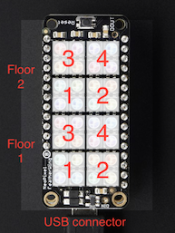

# pirNet

_A distributed home activity display system based on Passive InfraRed sensors and LED displays_

pirNet is an ESP8266 microcontroller project that displays activity information on an LED matrix display. It uses Passive InfraRed (PIR) sensors to detect activity, then sends its location to other pirNet devices on the network. The display shows activity of its sensors and the activity received from other sensors. A group of up to eight of these sensors/displays can be placed throughout a house to create a distributed display of movement.

The display allocates a 2x2 square of LEDs to a given sensor. You can configure eight sensors, filling the 4 by 8 LED display. You set the floor, room, and color of each sensor through a web page. They're organized into two floors of four rooms each, but that's arbitrary: you have eight positions on the display.

Each device is a Feather HUZZAH with ESP8266 with a NeoPixel 4x8 RGB LED FeatherWing attached via headers. The PIR sensor is attached only be wire so that it can be pointed as needed when mounted.

## Mounting the Devices

Mount the devices so that the display is visible to most of the room. Orient the PIR sensor toward the main source of motion such as a doorway or hallway.

#### Mounting height

You can decide how high up your walls to to locate the pirNet devices, depending on who will be making the motion you wish the devices to show.

Wall Height | Best for tracking
-----|------------
High | Drones, giraffes
Medium | People
Low | Cats, robots

 
## Code Demonstrations

The code in this project demonstrates several aspects of ESP8266 programming. The code is divided among several modules which can be used mostly independently. The modules show:

* WiFi setup using the [WifiManager library](https://github.com/tzapu/WiFiManager).
* Creating a unique version ID for each build using the compiler.
* Reading and writing configurations to EEPROM using SPIFFS.
* Writing to NeoPixel displays.
* Over-the-air updates. Super cool during development!
* Creating web pages that display data from the ESP8266 and submit forms to configure the ESP8266.
* Using internal timers.
* Broadcasting data over the network to multiple devices using UDP.
 

## Hardware

* [Adafruit Feather HUZZAH with ESP8266 WiFi](https://www.adafruit.com/products/2821)
* [Adafruit NeoPixel FeatherWing - 4x8 RGB LED Add-on For All Feather Boards](https://www.adafruit.com/products/2945)
* [Adafruit PIR (motion) sensor](https://www.adafruit.com/products/189)
* [Feather Header Kit - 12-pin and 16-pin Female Header Set](https://www.adafruit.com/products/2886)

## Assembly
Solder the PIR sensor to the NeoPixel as follows:

* NeoPixel FeatherWing pin USB --> PIR RED wire, +5V on PIR board
* NeoPixel FeatherWing pin 12 --> PIR YELLOW wire, OUT on PIR board
* NeoPixel FeatherWing pin GND --> PIR BLACK wire, GND on PIR board

As you can see in the photo, I soldered the wires to the LED board and secured them with zip ties to prevent stress on the solder joints. The wires could equivalently be soldered to the Feather HUZZAH with ESP8266 board.

## Software
* The software in this repository ([github.com/GaryBoone/pirNet](https://github.com/GaryBoone/pirNet))
* [PlatformIO](http://platformio.org/)
* The following libraries should be installed into PlatformIO:
  * [ 13  ] Adafruit-GFX
  * [ 28  ] Adafruit-NeoPixel
  * [ 64  ] Json
  * [ 135 ] Adafruit-SSD1306
  * [ 567 ] WifiManager

## Setup

#### Load software

Attach the Huzzah to your computer with a USB cable. Install the software with 

    $ pio run -t install

After that succeeds, you can run

    $ screen /dev/cu.SLAB_USBtoUART 115200

Hit the reset button on the device to reboot it. You'll see the serial output on your terminal. Among the first lines, you'll see the IP address of the device:

    OTA updates enabled
    Configuration server started.
    Software version: 20160503214912
    Local IP: 192.168.1.147
    Status: Connected
    Mode: Station
    ESP8266 Location: floor=1, room=4, color=0x00f33f17

Note the _Local IP_ address. That's the IP address your home network's router has assigned via DHCP to your device. 

#### OTA Updates

Once you know the IP address, you can update the code over the air (OTA):

    $ pio run -t upload --upload-port=192.168.1.147
    
#### Bulk uploads

Because pirNet is intended to work with a number of devices, there's a Bash script included that will compile and upload code to a number of devices. Just list the last octets of their IP addresses:

    $ ./upload.sh 119 124 147 154

Run the script without arguments to see more details.

#### Joining the device to your network

When you first power up the device, it will create a network called "PenumbralCogitation". You use that network to talk to the device and tell it how to join your home network.

_With your computer_, join the PenumbralCogitation network using password "objectsmean". [This password is only used when joining the network created by the ESP8266. You're in physical control of the device during this brief period. It can only be used to join the temporary network created by the device for setup, not your network. Change the password in the _src/wifiMgr.h_ if you like. The password isn't necessary if you set it to an empty string in _src/wifiMgr.h_.]

A captive portal web page will appear asking you to choose a local network. After entering credentials, hit the reset button on the pirNet device. If you have the pirNet device connected via USB and are using _screen_ as shown above, you'll see the device restart and join your network.

_With your computer_, rejoin your normal network. 

#### Configuring pirNet devices

Once the device is attached to your network, you can configure its location and color via a web page. Just enter the device's IP address into your browser's address bar and hit return.

Example:

    http://192.168.1.147

The configuration web page allows you to set the floor, room, and color of each device. Floors may be 1 or 2. Rooms may be 1 through 4. Each room will be assigned a square of 4 pixels on the 4 by 8 LED display. 

#### Display Layout

The rooms/floors are mapped to the display as show here:

#### Available Web Pages

* __/__ to configure the device.
* __/reset__ to reset the device.

### TODO

* pirNet needs a case, something 3D printed that would allow mounting on a wall and allow the PIR sensor to be rotated so it would point correctly no matter how the device is mounted.

## License
The code is available at github [GaryBoone/pirNet](https://github.com/GaryBoone/pirNet) under the [MIT license](http://opensource.org/licenses/mit-license.php).